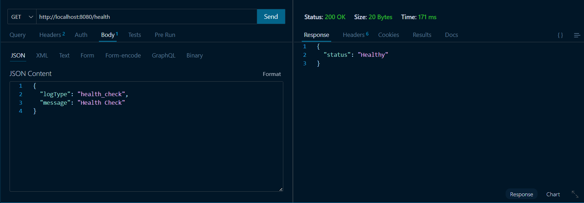
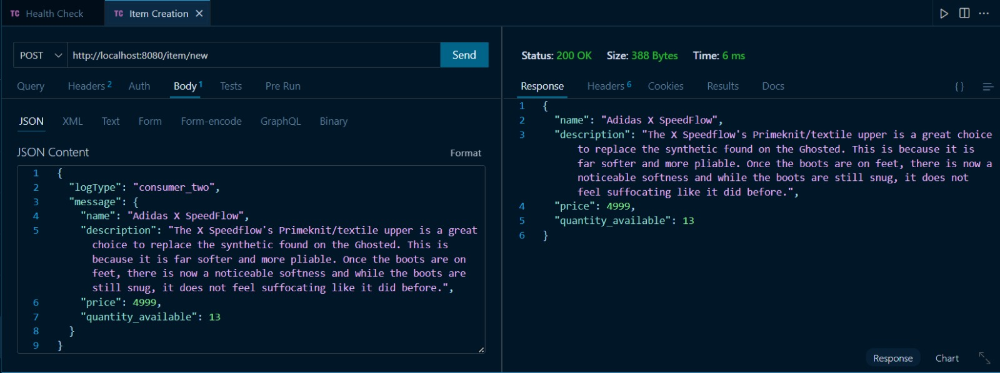

# Inventory Management System

## Overview
Backend Inventory Management System using Node JS. 
RabbitMQ used as a message broker and Docker used for containerization.
MongoDB used as the database to store inventory data.

## Preview

## Key Features
1. Health Check Microservice to make sure the server is up and running. (consumer_one)
1. Item Creation Microservice to create an item. (consumer_two)
1. Stock Management Microservice to manage stock data in the MongoDB Database. (consumer_three)
1. Order Processing Microservice to place/update orders and get order details. (consumer_four)
1. Producer Microservice to handle api routes. (producer)
